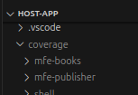

# Version

Angular: 18.0.6
cypress: 13.15.0
bootstrap: 5.3.3
karma: 6.4.0
karma-jasmine: 5.1.0

## Development server

Run `npm start` for a dev server. Navigate to `http://localhost:4000/`. The application will automatically reload if you change any of the source files. Represents aplication Shell

## Running unit tests

Run `npm test` to execute the unit tests via [Karma](https://karma-runner.github.io). 
Has Code coverage in:
Execution in microfrontends separate : entry in directory of application
projects/shell
projects/mfe-books
projects/mfe-publisher

## Running end-to-end tests

Run `npx cypress`in directory: host-app/projects/shell to execute the end-to-end tests via a platform of your choice. To use this command, you need to first add a package that implements end-to-end testing capabilities.

## Mock api json run:
json-server --watch db.json
port: http://localhost:3000
http://localhost:3000/books
http://localhost:3000/profile
http://localhost:3000/publishers

## run aplication
npm start
port: http://localhost:4000/

##Data Base
File: db.json project base 
## Directories Architeture

## Description
# Project Overview

This project was created using **Angular version 18** and follows a **Microfrontend architecture** utilizing **Module Federation** and **Webpack**. The architecture consists of three microfrontends:

- **Shell**: Acts as the orchestrator for the other two microfrontends. To log in, use the credentials:
  - **Username**: admin@admin.com
  - **Password**: 123456

- **mfe-books**: This microfrontend represents a list of books with full CRUD functionality (Create, Read, Update, Delete) and search features interacting with a mock API. *(Note: the booking icon feature is still under construction.)*

- **mfe-publisher**: This microfrontend represents a list of publishers, where data is consumed from local storage. The relationship between publishers and books is still under development.

### Key Features:
- **Shell**: Handles setting publisher data in local storage using `storageService` and `publisherService`.
- **mfe-publisher**: Consumes the publisher data from local storage and makes it available in the publisher list.
- **Login**: Includes a profile creation option via the “Register” button.

